# Praktikum 1 : Instalasi Lumen, MongoDB, dan Konfirgurasi App Key

### composer 
instalasi composer sudah dilakukan sebelumnya, cek apakah composer sudah berjalan.
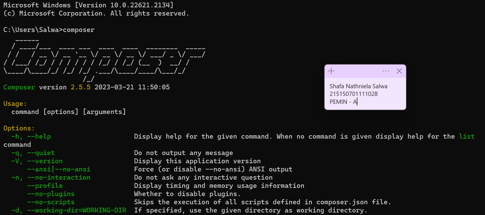 
### instalasi mongodb
install mongodb dari halaman https://www.mongodb.com/try/download/community 
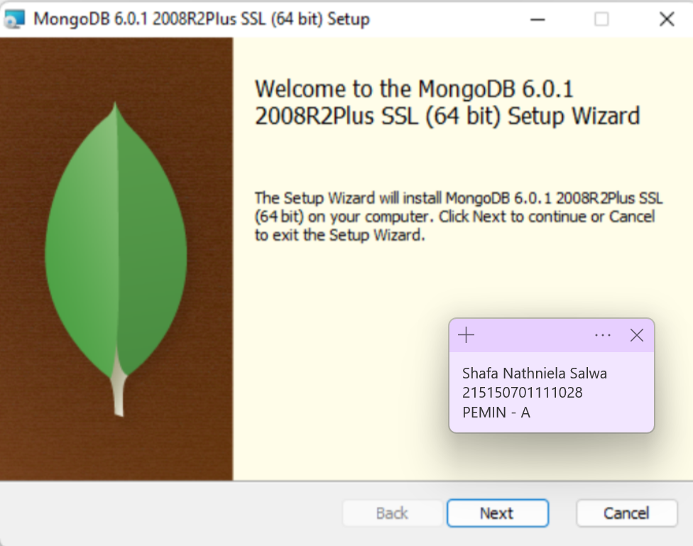
 
pilih complete install pada instalasi mongodb
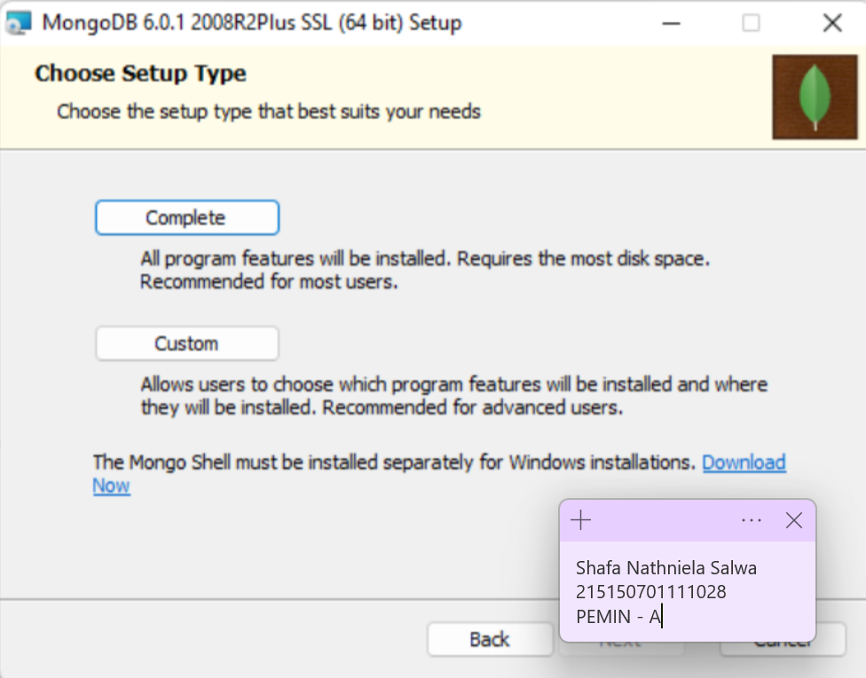
 
tanpa mengubah settingan apapun, klik next
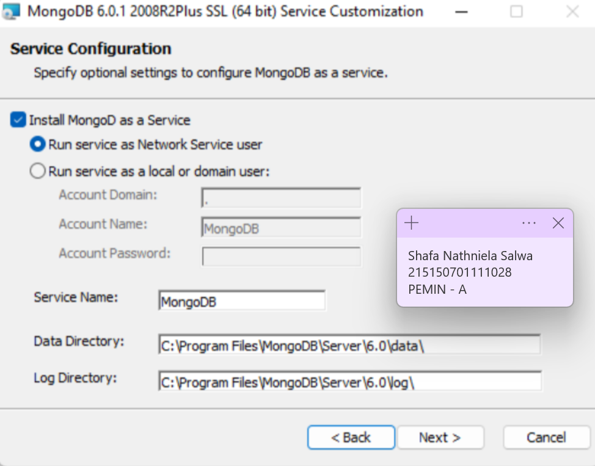
 
centang pada pilihan "Install MongoDB Compass", lalu next
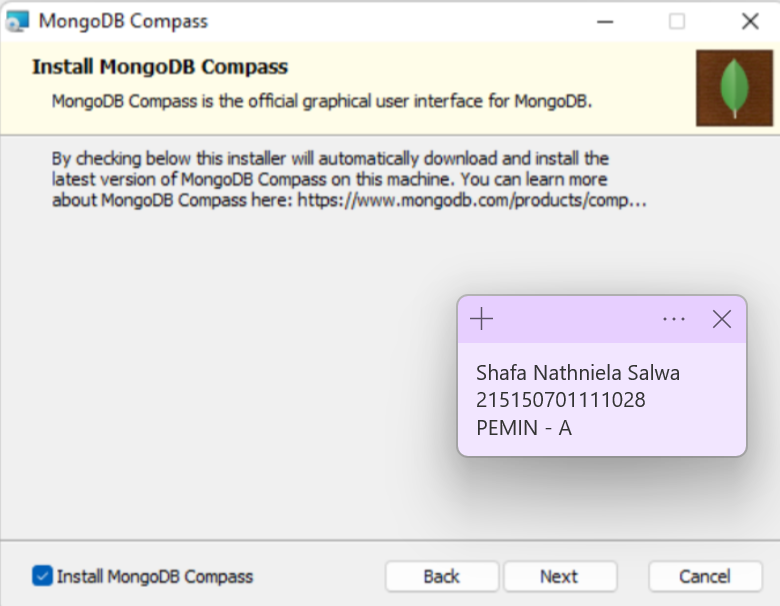
 
pilih option install, lalu tunggu hingga instalasi selesai
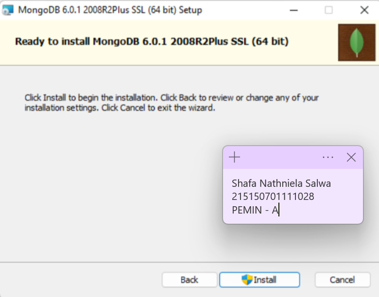
 
setelah instalasi berhasil, mongodb compass akan muncul
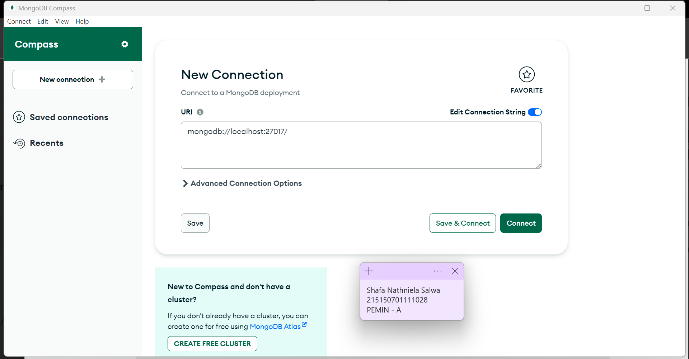

### lumen dan konfigurasi app key
buka direktori tempat lumen akan diinstall
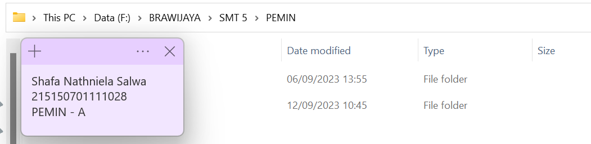
 
masuk ke terminal dan buka folder tempat lumen akan diinstall, lalu ketikkan composer create-project --prefer-dist laravel/lumen lumenapi 
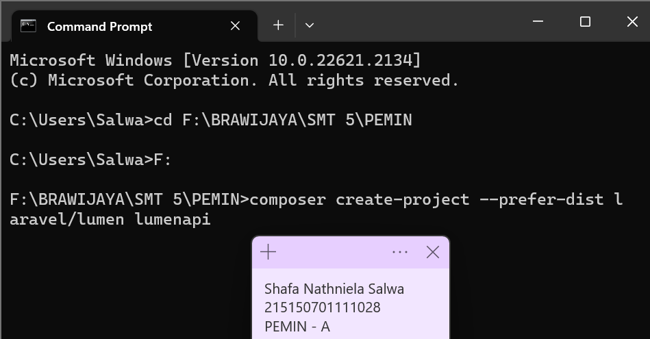 
 
untuk menjalankan server, ketikkan php -S localhost:8000 -t public pada terminal visual studio code
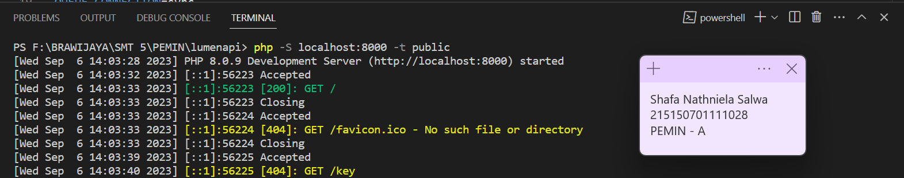
 
Buka file web.php pada folder routes, kemudian buat endpoint yang akan mengembalikan random string dengan panjang 32
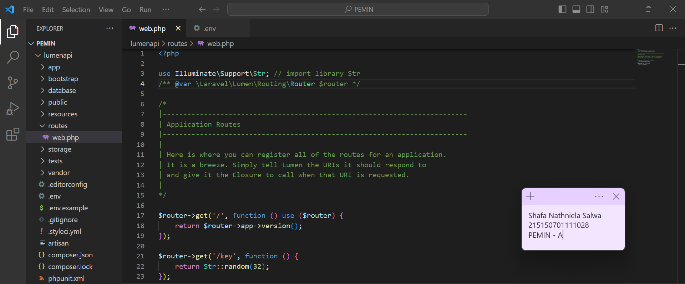
 
buka "localhost:8000" pada browser untuk mnengecek apakah lumen sudah terinstall
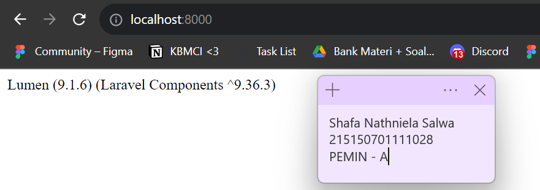

 
tambahkan "/key" untuk melakukan generate app key
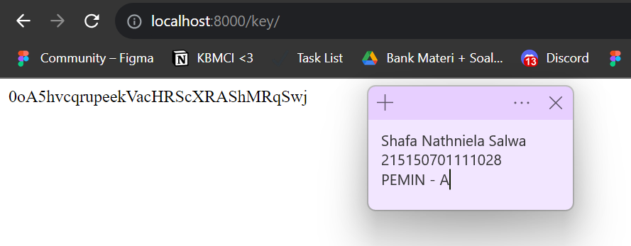

 
copy key tersebut ke file .env pada projek lumenapi
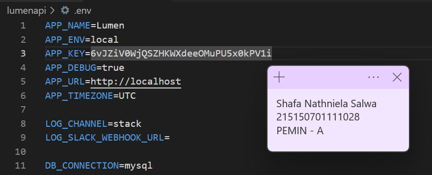 
