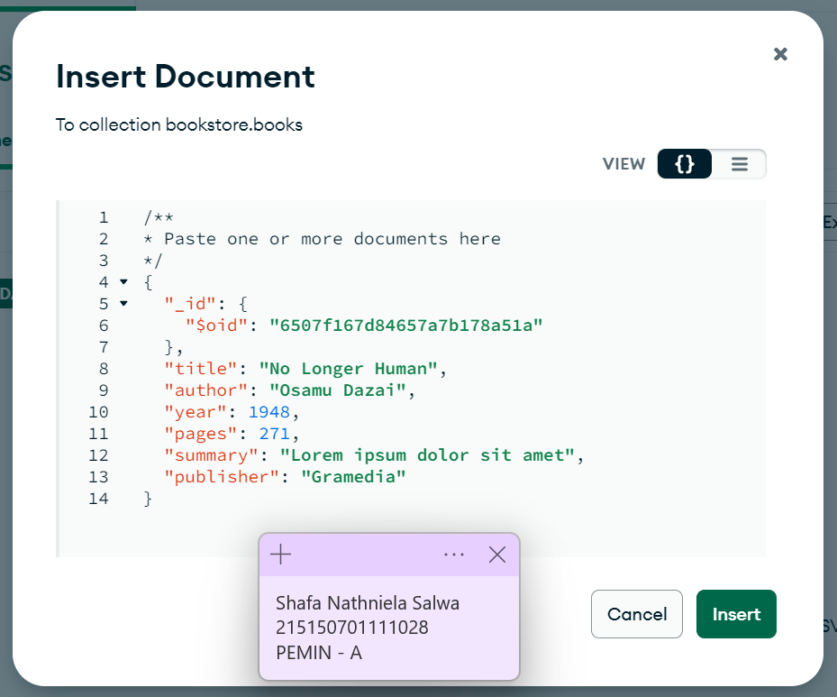

# CRUD MongoDB Compass dan Shell

* ## MongoDB Compass
  MongoDB Compass adalah tool berbasis Graphical User Interface (GUI) yang digunakan untuk melakukan aktivitas dasar CREATE, READ, UPDATE, dan DELETE (CRUD) tanpa commad line pada MongoDB. Berikut adalah langkah-langkah untuk melakukan CRUD pada MongoDB Compass: <br>
  a. Lakukan koneksi ke MongoDB menggunakan connection string <br>
      <br>
  b. Buat database baru dengan menekan tanda plus "+", maka MongoDB Compass akan menampilkan input form seperti di bawah <br>
      <br>
  c. Isi informasi yang ada dan klik "Create Database". Database baru akan dibuat oleh MongoDB Compass <br>
      <br>
  c. Pada percobaan ini, proses CREATE dilakukan dengan insert buku pertama dengan melakukan klik "Add Data", pilih "Insert Document", <br>
  isi dengan data yang diinginkan dan klik "Next" <br>
    <br>
  d. Lakukan insert buku kedua dengan cara yang sama <br>
       <br>
  e. Proses READ dilakukan dengan cara mencari buku dengan author "Osamu Dazai" dengan mengisi filter yang diinginkan dan klik "Find" <br>
    <br>
      <br>
      <br>
  f. Sedangkan untuk proses UPDATE, dilakukan perubahan summary pada buku "No Longer Human" menjadi "Buku yang bagus (NAMA,NIM) dengan melakukan klik "Edit Document" (berlambang pensil), mengisi nilai summary yang baru, dan melakukan klik "Update" <br>
      <br>
      <br>
  g. Proses DELETE, dilakukan dengan cara penghapusan pada buku "I Am a Cat" dengan melakukan klik "Remove Document" (berlambang tong sampah) dan melakukan klik "Delete" <br>
      <br>
     
* ## MongoDB Shell
  MongoDB Shell merupakan tool untuk melakukan aktivitas CRUD yang berbasis Command Line Interface (CLI). MongoDB Shell dapat diakses langsung dari MongoDB Compass atau menggunakan perintah mongosh pada Command Prompt. Berikut adalah langkah-langkah untuk melakukan CRUD pada MongoDB Shell: <br>
  a. Lakukan koneksi ke MongoDB dengan menjalankan command ```mongosh``` pada terminal yang ada di OS <br>
      <br>
  b. Lihat list database yang ada di server dengan menjalankan command ```show dbs``` <br>
      <br>
    Untuk berpindah ke database "bookstore" gunakan command ```use bookstore``` dan memastikan database telah berpindah dengan melihat tulisan sebelum tanda ">" <br>
      <br>
  Untuk melihat collection yang ada pada database tersebut gunakan command ```show collection``` <br>
      <br>
  c. Proses CREATE pada MongoDB Shell dapat dilakukan secara satu per satu atau langsung membuat banyak. Untuk membuat objek baru, dilakukan insert buku "Overlord I" dengan menggunakan command ```db.books.insertOne(data)``` <br>
      <br>
  d. Sementara untuk membuat objek baru lebih dari satu, dilakukan insert buku "The Setting Sun" dan "Hujan" dengan insert many dengan menggunakan command ```db.books.insertMany(data)``` <br>
      <br>
  e. Aktivitas READ, dilakukan dengan pencarian buku dengan menggunakan command ```db.books.find()``` untuk melakukan pencarian semua buku <br>
      <br>
  f. Tampilkan seluruh buku dengan author "Osamu Dazai" dengan mengisi argument pada find() dengan menggunakan command ```db.books.find({filter})``` <br>
      <br>
  g. Proses UPDATE dapat dilakukan dengan melakukan perubahan summary pada buku "Hujan" menjadi "Buku yang bagus (NAMA, NIM) dengan menggunakan command ```db.books.updateOne({filter}, {$set: {data yang ingin diupdate}})``` <br>
      <br>
  h. Lakukan perubahan publisher menjadi "Yen Press" pada semua buku "Osamu Dazai" dengan menggunakan command ```db.books.updateMany({filter}, {$set: {data yang ingin diupdate}})``` <br>
      <br>
  i. Proses DELETE, dilakukan dengan penghapusan pada buku "Overlord I" dengan menggunakan command ```db.books.deleteOne({argument})``` <br>
      <br>
  j. Lakukan penghapusan pada semua buku "Osamu Dazai" dengan menggunakan command ```db.books.deleteMany({argument})``` <br>
      <br>
Untuk melihat hasil dari proses CRUD di atas, dapat dilakukan pencarian seluruh buku menggunakan command ```db.books.find()```
      <br>
