# Instalasi MongoDB dan Express  
### Percobaan Instalasi NodeJS

1. Setelah instalasi selesai jalankan command `node -v` untuk memeriksa apakah NodeJS sudah terinstall  
  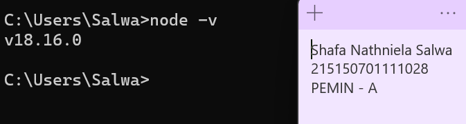  

### Inisiasi project Express dan pemasangan package
1. Lakukan pembuatan folder dengan nama express-mongodb dan masuk ke dalam folder tersebut lalu buka melalui text editor masing-masing  
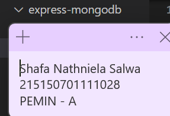  
2. Lakukan npm init untuk mengenerate file package.json dengan menggunakan command `npm init -y`  
 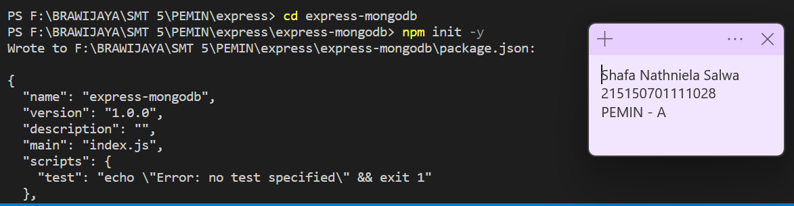  
3. Lakukan instalasi express, mongose, dan dotenv dengan menggunakan command `npm i express mongose dotenv`  
 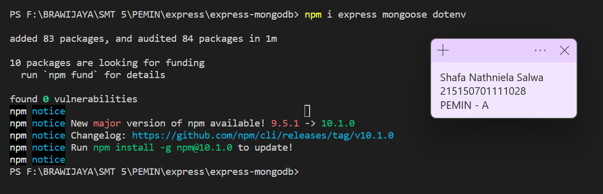  

   ### Koneksi Express ke MongoDB
   1. Buatlah file index.js pada root folder dan masukkan kode di bawah ini  
` require('dotenv').config();
const express = require('express');
const mongoose = require('mongoose');
const app = express();
app.use(express.json());
app.get('/', (req, res) => {
res.status(200).json({
message: '<nama>,<nim>'
})
})
const PORT = 8000;
app.listen(PORT, () => {
console.log(`Running on port ${PORT}`);
})`
   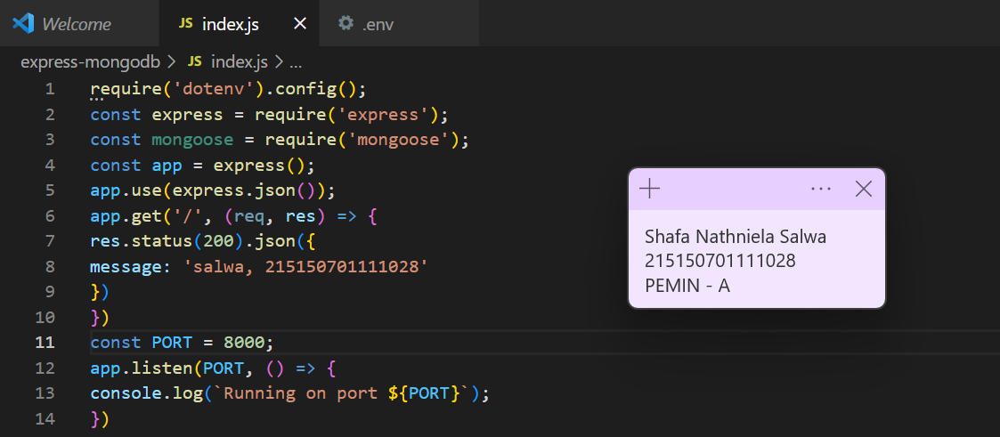   
   2. Setelah itu coba jalankan aplikasi dengan command `node index.js`  
    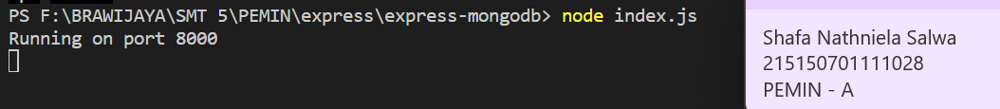  
   3. Lakukan pembuatan file .env dan masukkan baris berikut. Setelah itu ubahlah kode pada listening port menjadi berikut dan coba jalankan aplikasi kembali  
  ` const PORT = process.env.PORT || 8000;
app.listen(PORT, () => {
console.log(`Running on port ${PORT}`);
})`
   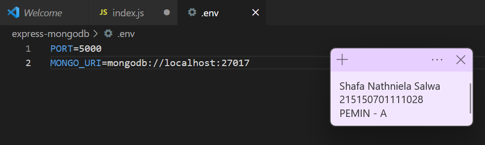  
   4. Copy connection string yang terdapat pada compas atau atlas dan paste kan pada .env seperti berikut  
  ` MONGO_URI=<Connection string masing-masing>`
    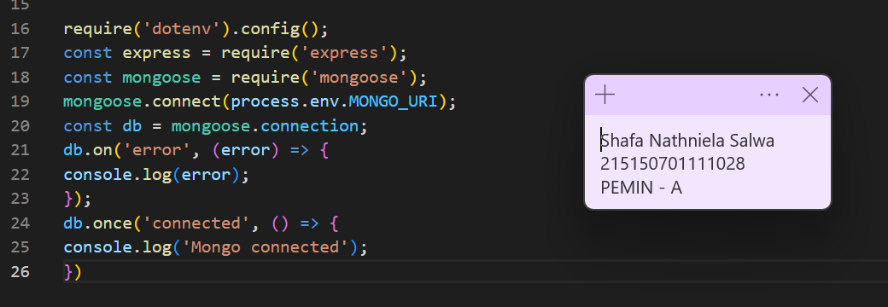  
   5. Tambahkan baris kode berikut pada file index.js. Setelah itu coba jalankan aplikasi kembali.  
   `require('dotenv').config();
const express = require('express');
const mongoose = require('mongoose');
mongoose.connect(process.env.MONGO_URI);
const db = mongoose.connection;
db.on('error', (error) => {
console.log(error);
});
db.once('connected', () => {
console.log('Mongo connected');
})`
    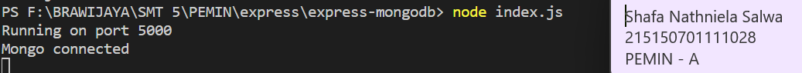  

   ### Pembuatan routing
   1. Lakukan pembuatan direktori routes di tingkat yang sama dengan index.js  
   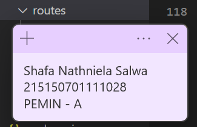  
   2. Buatlah file book.route.js di dalamnya  
   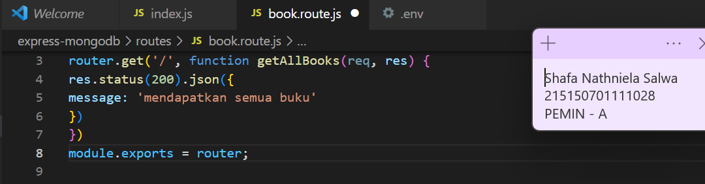  
   3. Tambahkan baris kode berikut untuk fungsi getAllBooks, getOneBook, createBook, updateBook, dan deleteBook  
   `const router = require('express').Router();
router.get('/', function getAllBooks(req, res) {
res.status(200).json({
message: 'mendapatkan semua buku'
})
})
const router = require('express').Router();
...
router.get('/:id', function getOneBook(req, res) {
const id = req.params.id;
res.status(200).json({
message: 'mendapatkan satu buku',
id,
})
})
router.post('/', function createBook(req, res) {
res.status(200).json({
message: 'membuat buku baru'
})
})
router.put('/:id', function updateBook(req, res) {
const id = req.params.id;
res.status(200).json({
message: 'memperbaharui satu buku',
id,
})
})
router.delete('/:id', function deleteBook(req, res) {
const id = req.params.id;
res.status(200).json({
message: 'menghapus satu buku',
id,
})
})
module.exports = router;`
   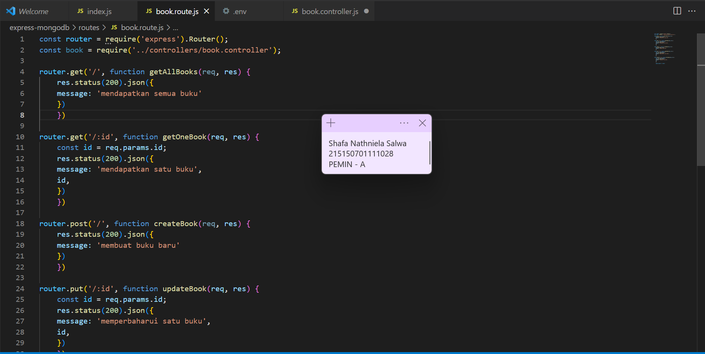  
  4. Lakukan import book.route.js pada file index.js dan tambahkan baris kode berikut  
  `require('dotenv').config();
const express = require('express');
const mongoose = require('mongoose');
const bookRoutes = require('./routes/book.route'); //
...
app.get('/', (req, res) => {
res.status(200).json({
message: '<nama>,<nim>'
})
})
app.use('/books', bookRoutes); //
const PORT = process.env.PORT || 8000;
app.listen(PORT, () => {
console.log(`Running on port ${PORT}`);
})`
  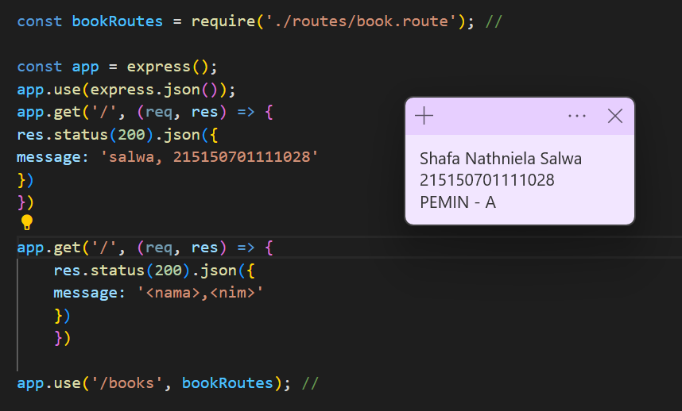  
  5. Uji salah satu endpoint dengan Postman  
  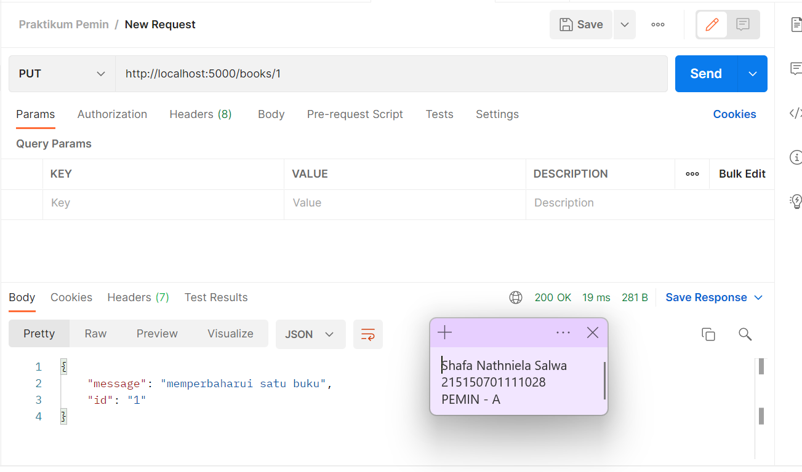  

   ### Pembuatan controller
   1. Lakukan pembuatan direktori controllers di tingkat yang sama dengan index.js  
   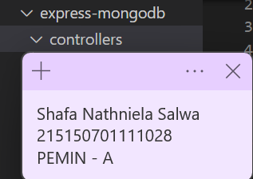  
   2. Buatlah file book.controller.js di dalamnya  
   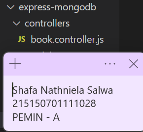  
   3. Salin baris kode dari routes untuk fungsi getAllBooks, getOneBook, createBook, updateBook, dan deleteBook  
 `  function getAllBooks(req, res) {
res.status(200).json({
message: 'mendapatkan semua buku'
})
};
module.exports = {
getAllBooks,
}
function getOneBook(req, res) {
const id = req.params.id;
res.status(200).json({
message: 'mendapatkan satu buku',
id,
})
}
function createBook(req, res) {
res.status(200).json({
message: 'membuat buku baru'
})
}
function updateBook(req, res) {
const id = req.params.id;
res.status(200).json({
message: 'memperbaharui satu buku',
id,
})
}
function deleteBook(req, res) {
const id = req.params.id;
res.status(200).json({
message: 'menghapus satu buku',
id,
})
}
module.exports = {
getAllBooks,
getOneBook, //
createBook, //
updateBook, //
deleteBook //
}`
    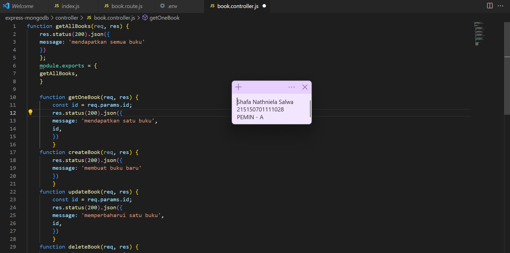  
  4. Lakukan import book.controller.js pada file book.route.js dan lakukan perubahan pada fungsi agar dapat memanggil fungsi dari book.controller.js  
  `const router = require('express').Router();
const book = require('../controllers/book.controller'); //
...
module.exports = router;`
    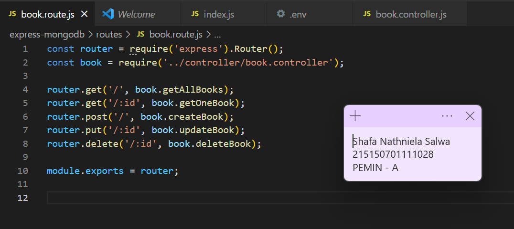  
  5. Lakukan pengujian kembali, pastikan response tetap sama  
  `const router = require('express').Router();
const book = require('../controllers/book.controller');
router.get('/', book.getAllBooks);
router.get('/:id', book.getOneBook);
router.post('/', book.createBook);
router.put('/:id', book.updateBook);
router.delete('/:id', book.deleteBook);
module.exports = router;`
     

   ### Pembuatan model
   1. Lakukan pembuatan direktori models di tingkat yang sama dengan index.js  
   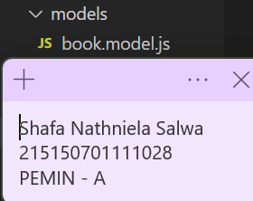  
   2. Buatlah file book.model.js di dalamnya  
      
   3. Tambahkan baris kode berikut sesuai dengan tabel di atas  
  ` const mongoose = require('mongoose');
const bookSchema = new mongoose.Schema({
title: {
type: String
},
author: {
type: String
},
year: {
type: Number
},
pages: {
type: Number
},
summary: {
type: String
},
publisher: {
type: String
}
})
module.exports = mongoose.model('book', bookSchema);`
    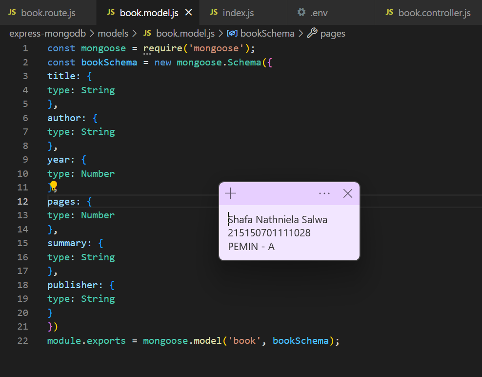  

   ### Operasi CRUD
   1. Hapus semua data pada collection books  
    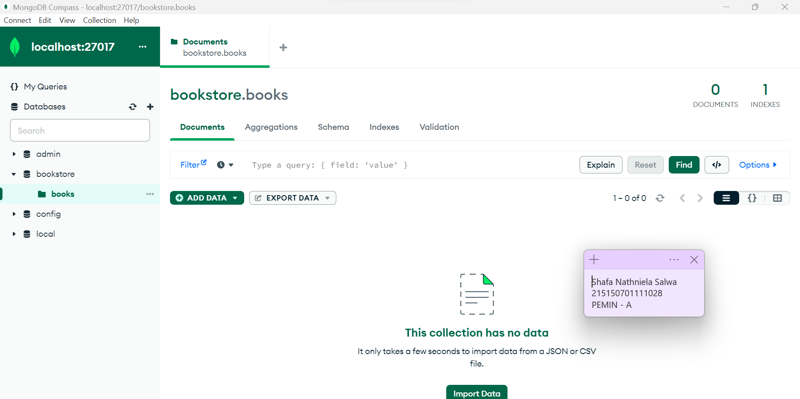  
   2. Lakukan import book.model.js pada file book.controller.js  
`const Book = require('../models/book.model');`
      
   3. Lakukan perubahan pada fungsi createBook  
   `const Book = require('../models/book.model');
...
async function createBook(req, res) {
const book = new Book({
title: req.body.title,
author: req.body.author,
year: req.body.year,
pages: req.body.pages,
summary: req.body.summary,
publisher: req.body.publisher,
})
try {
const savedBook = await book.save();
res.status(200).json({
message: 'membuat buku baru',
book: savedBook,

})
} catch (error) {
res.status(500).json({
message: 'kesalahan pada server',
error: error.message,
})
}
}`
   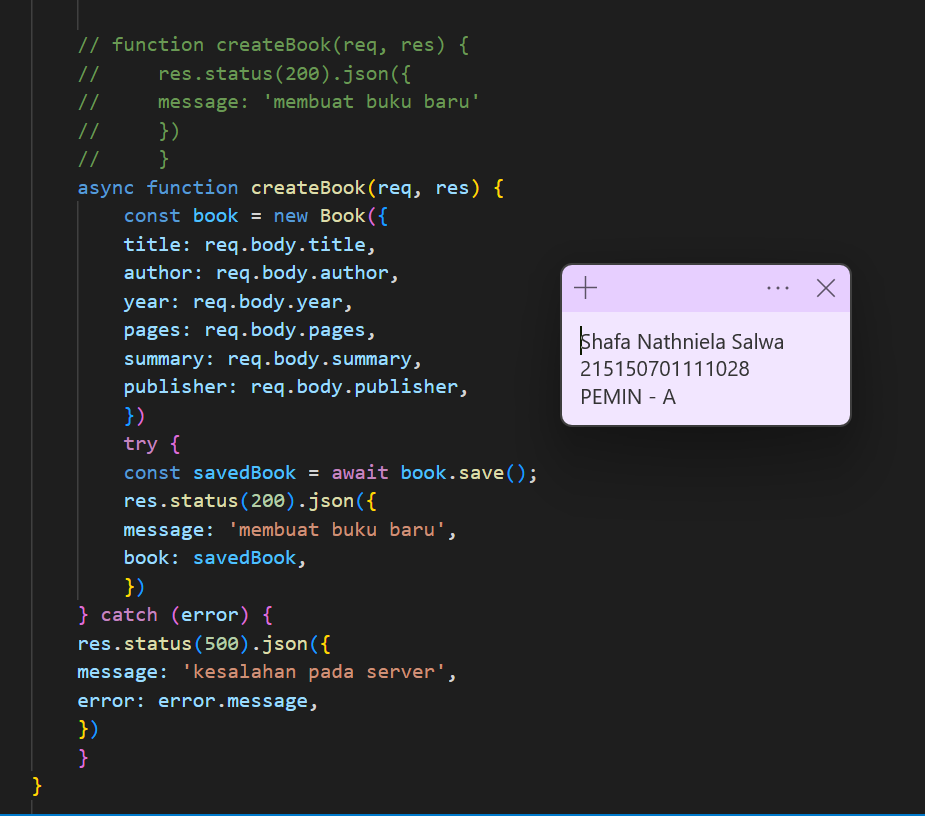  
   4. Buatlah dua buah buku dengan data di bawah ini dengan Postman  
`   {
"title": "Dilan 1990",
"author": "Pidi Baiq",
"year": 2014,
"pages": 332,
"summary": "Mirea, anata wa utsukushī",
"publisher": "Pastel Books"
}`
   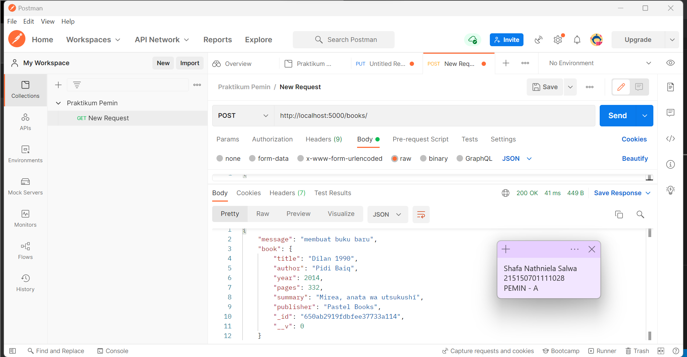  
`   {
"title": "Dilan 1991",
"author": "Pidi Baiq",
"year": 2015,
"pages": 344,
"summary": "Watashi ga kare o aishite iru to ittara",
"publisher": "Pastel Books"
}`
      
   5. Lakukan perubahan pada fungsi getAllBooks  
`   const Book = require('../models/book.model');
async function getAllBooks(req, res) {
try {
const books = await Book.find();
res.status(200).json({
message: 'mendapatkan semua buku',
books,
})
} catch (error) {
res.status(500).json({
message: 'kesalahan pada server',
error: error.message,
})
}
}`
    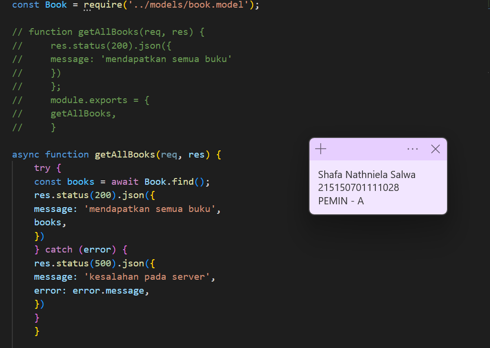  
   6. Lakukan perubahan pada fungsi getOneBook  
`   const Book = require('../models/book.model');
...
async function getOneBook(req, res) {
const id = req.params.id;
try {
const book = await Book.findById(id);
res.status(200).json({
message: 'mendapatkan satu buku',
book,
})
} catch (error) {
res.status(500).json({
message: 'kesalahan pada server',
error: error.message,
})
}
}`
    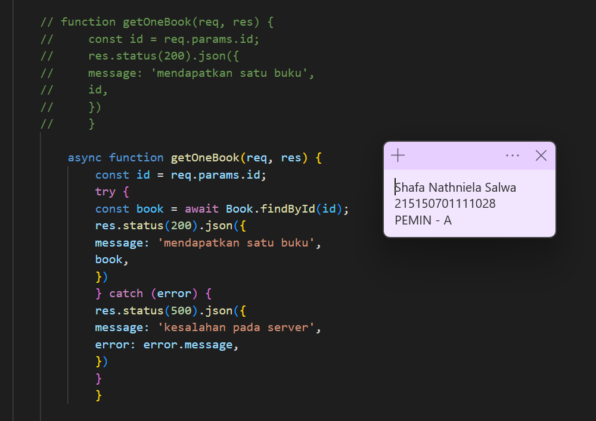  
   7. Tampilkan semua buku dengan Postman  
    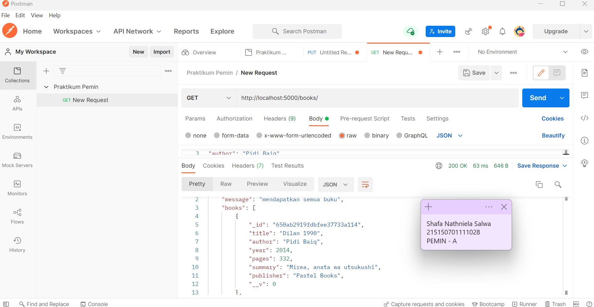  
   8. Tampilkan buku Dilan 1990 dengan Postman  
    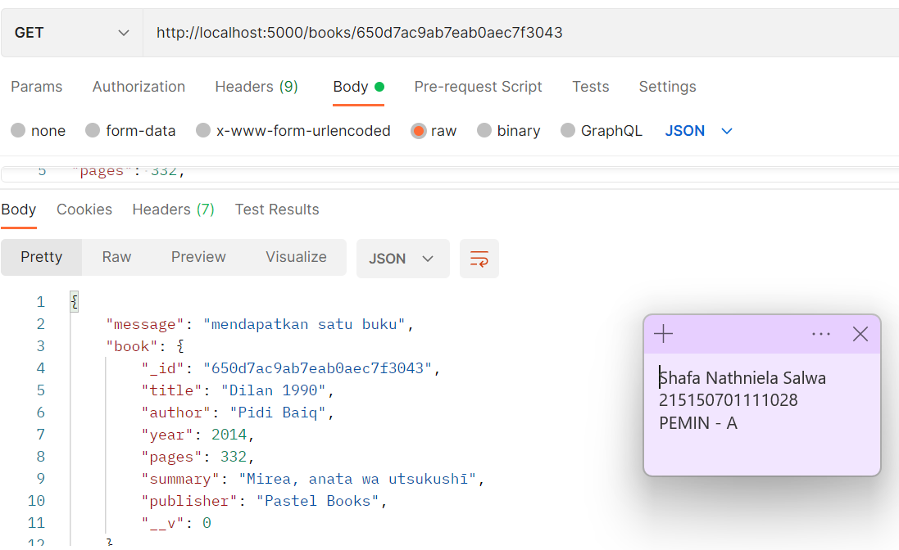  
   9. Lakukan perubahan pada fungsi updateBook  
 `  const Book = require('../models/book.model');
...
async function updateBook(req, res) {
const id = req.params.id;
try {
const book = await Book.findByIdAndUpdate(
id, req.body, { new: true }
)
res.status(200).json({
message: 'memperbaharui satu buku',
book,
})
} catch (error) {
res.status(500).json({
message: 'kesalahan pada server',
error: error.message,
})
}
}`
    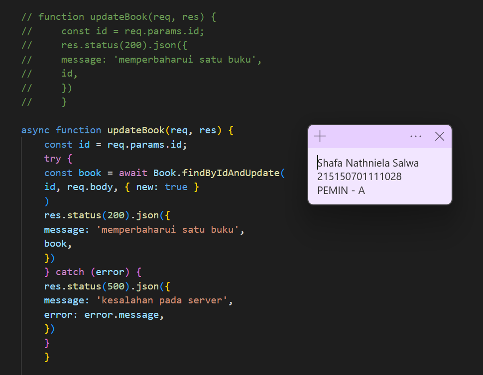  
   10. Ubah judul buku Dilan 1991 menjadi “<NAMA PANGGILAN> 1991” dengan Postman  
    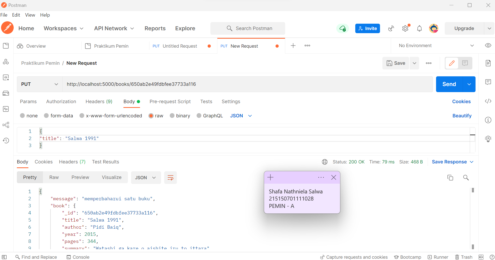  
  11. Lakukan perubahan pada fungsi deleteBook  
`  const Book = require('../models/book.model');
...
async function deleteBook(req, res) {
const id = req.params.id;
try {
const book = await Book.findByIdAndDelete(id);
res.status(200).json({
message: 'menghapus satu buku',
book,
})
} catch (error) {
res.status(500).json({
message: 'kesalahan pada server',
error: error.message,
})
}
}`
   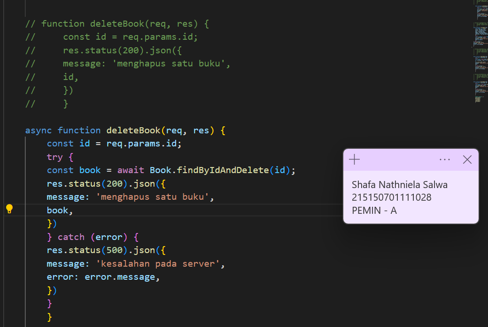  
  12. Hapus buku Dilan 1990 dengan Postman 
   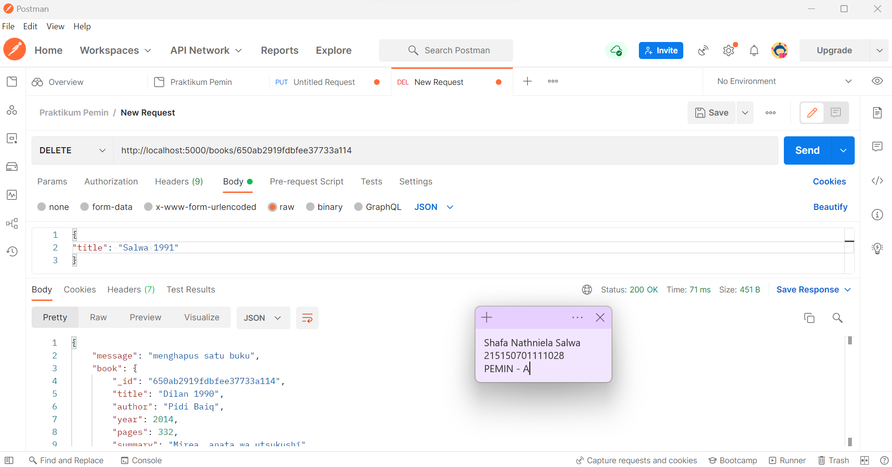  
   

