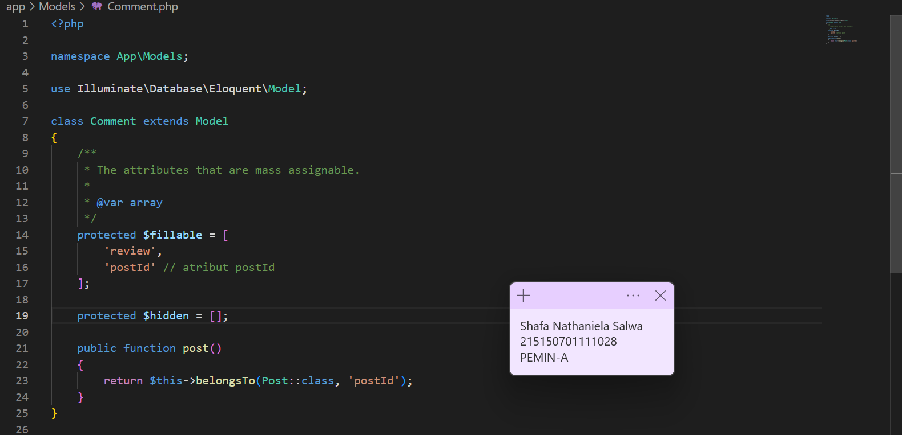
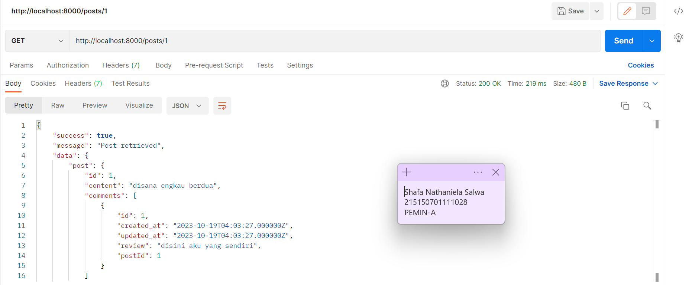
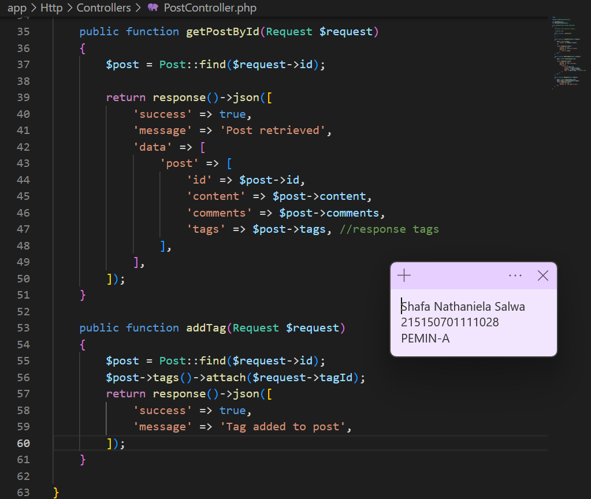
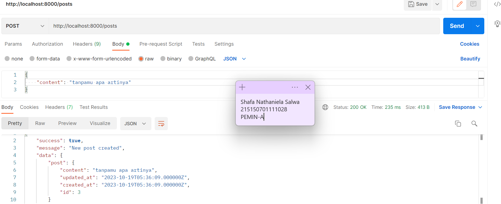

# Relasi One-to-Many dan Many-to-Many
## Langkah Percobaan
### Pembuatan Tabel
Berikut adalah tabel yang akan digunakan pada percobaan ini

<table>
<tr>
<td>post</td> 
<td>comments </td>
<td>tags </td>
<td>post_tag </td>
</tr>
<tr>
<td>id</td> 
<td>id </td>
<td>id </td>
<td>postId </td>
</tr>
<tr>
<td>content (STRING)</td>
<td>review (STRING)</td>
<td>name</td>
<td>tagId</td>
</tr>
</table>
<br>

1. Sebelum membuat migrasi database atau membuat tabel pastikan server database
aktif kemudian pastikan sudah membuat database dengan nama lumenpost


2. Kemudian ubah konfigurasi database pada file .env menjadi seperti berikut
```
DB_CONNECTION=mysql
DB_HOST=127.0.0.1
DB_PORT=3306
DB_DATABASE=lumenpost
DB_USERNAME=root
DB_PASSWORD=
```


3. Setelah mengubah konfigurasi pada file .env, kita juga perlu menghidupkan
beberapa library bawaan dari lumen dengan membuka file app.php pada folder
bootstrap dan mengubah baris ini
```
// $app->withFacades();
// $app->withEloquent();
```
menjadi
```
$app->withFacades();
$app->withEloquent();
```


4. Setelah itu jalankan command berikut untuk membuat file migration
```
php artisan make:migration create_posts_table
php artisan make:migration create_comments_table
php artisan make:migration create_tags_table
php artisan make:migration create_post_tag_table
```


5. 5. Ubah fungsi `up()` pada file migrasi `create_posts_table`
```
#sebelumnya
...
public function up()
{
Schema::create('posts', function (Blueprint $table) {
$table->id();
$table->timestamps();
});
}
```

diubah menjadi
```
public function up()
{
Schema::create('posts', function (Blueprint $table) {
$table->id();
$table->timestamps();
$table->string('content');
});
}
```


6. Ubah fungsi `up()` pada file `create_comments_table`
sebelumnya
```
public function up()
{
Schema::create('comments', function (Blueprint $table) {
$table->id();
$table->timestamps();
});
}
```
menjadi
```
public function up()
{
Schema::create('comments', function (Blueprint $table) {
$table->id();
$table->timestamps();
$table->string('review');
$table->foreignId('postId')->unsigned();
});
}
```


7. Ubah fungsi `up()` pada file `create_tags_table`
sebelumnya
```
public function up()
{
Schema::create('tags', function (Blueprint $table) {
$table->id();
$table->timestamps();
});
}
```
diubah menjadi
```
public function up()
{
Schema::create('tags', function (Blueprint $table) {
$table->id();
$table->timestamps();
$table->string('name');
});
}
```


8. Ubah fungsi `up()` pada file `create_post_tag_table`
sebelumnya
```
public function up()
{
Schema::create('post_tag', function (Blueprint $table) {
$table->id();
$table->timestamps();
});
}
```

diubah menjadi
```
public function up()
{
Schema::create('post_tag', function (Blueprint $table) {
$table->id();
$table->timestamps();
$table->foreignId('postId')->unsigned();
$table->foreignId('tagId')->unsigned();
});
}
```

9. Kemudian jalankan command `php artisan migrate`


### Pembuatan model
1. Buatlah file dengan nama Post.php dan isi dengan baris kode berikut

```
<?php
namespace App\Models;
use Illuminate\Database\Eloquent\Model;
class Post extends Model
{
/**
* The attributes that are mass assignable.
*
* @var string[]
*/
protected $fillable = [
'content'
];
/**
* The attributes excluded from the model's JSON form.
*
* @var string[]
*/
protected $hidden = [];
}
```


2. Buatlah file dengan nama Comment.php dan isi dengan baris kode berikut

```
<?php
namespace App\Models;
use Illuminate\Database\Eloquent\Model;
class Comment extends Model
{
/**
* The attributes that are mass assignable.
*
* @var string[]
*/
protected $fillable = [
'review'
];
/**


* The attributes excluded from the model's JSON form.
*
* @var string[]
*/
protected $hidden = [];
}
```


3. Buatlah file dengan nama Tag.php dan isi dengan baris kode berikut
```
<?php
namespace App\Models;
use Illuminate\Database\Eloquent\Model;
class Tag extends Model
{
/**
* The attributes that are mass assignable.
*
* @var string[]
*/
protected $fillable = [
'name'
];
/**
* The attributes excluded from the model's JSON form.
*
* @var string[]
*/
protected $hidden = [];
}
```


### Relasi One to Many
1. Tambahkan fungsi comments() pada file Post.php

```
<?php
namespace App\Models;
use Illuminate\Database\Eloquent\Model;
class Post extends Model
{

// fungsi comments
public function comments()
{
return $this->hasMany(Comment::class, 'postId');
}
}
```


2. Tambahkan fungsi post() dan atribut postId pada $fillable pada file Comment.php
```
<?php
namespace App\Models;
use Illuminate\Database\Eloquent\Model;
class Comment extends Model
{
...
protected $fillable = [
'review',
'postId' // atribut postId
];
/**
* The attributes excluded from the model's JSON form.
*
* @var string[]
*/
protected $hidden = [];
public function post()
{
return $this->belongsTo(Post::class, 'postId');
}
}
```


3. Buatlah file PostController.php dan isilah dengan baris kode berikut
```
<?php
namespace App\Http\Controllers;
use App\Models\Post;
use Illuminate\Http\Request;
class PostController extends Controller
{
/**
* Create a new controller instance.
*
* @return void
*/
public function __construct()
{
//
}
//
public function createPost(Request $request)
{
$post = Post::create([
'content' => $request->content,
]);
return response()->json([
'success' => true,
'message' => 'New post created',
'data' => [
'post' => $post
]
]);
}
public function getPostById(Request $request)
{
$post = Post::find($request->id);
return response()->json([
'success' => true,
'message' => 'All post grabbed',
'data' => [
'post' => [
'id' => $post->id,
'content' => $post->content,
'comments' => $post->comments,
]
]
]);
}
}
```


4. Buatlah file CommentController.php dan isilah dengan baris kode berikut
```
<?php
namespace App\Http\Controllers;
use App\Models\Comment;
use Illuminate\Http\Request;
class CommentController extends Controller
{
/**
* Create a new controller instance.
*
* @return void
*/
public function __construct()
{
//
}
//
public function createComment(Request $request)
{
$comment = Comment::create([
'review' => $request->review,
'postId' => $request->postId,
]);
return response()->json([
'success' => true,
'message' => 'New comment created',
'data' => [
'comment' => $comment
]
]);
}
}
```


5. Tambahkan baris berikut pada routes/web.php
```
<?php
...
$router->group(['prefix' => 'posts'], function () use ($router) {
$router->post('/', ['uses' => 'PostController@createPost']);
$router->get('/{id}', ['uses' => 'PostController@getPostById']);
});
$router->group(['prefix' => 'comments'], function () use ($router) {
$router->post('/', ['uses' => 'CommentController@createComment']);
});
```


6. Buatlah satu post menggunakan Postman


7. Buatlah satu comment menggunakan Postman


8. Tampilkan post menggunakan Postman


### Relasi Many to many
1. Tambahkan fungsi tags() pada file Post.php
```
<?php
namespace App\Models;
use Illuminate\Database\Eloquent\Model;
class Post extends Model
{
...
public function tags()
{
return $this->belongsToMany(Tag::class, 'post_tag', 'postId', 'tagId');
}
}
```


2. Tambahkan fungsi posts() pada file Tag.php
```
<?php
namespace App\Models;
use Illuminate\Database\Eloquent\Model;
class Tag extends Model
{
...
public function posts()
{
return $this->belongsToMany(Post::class, 'post_tag', 'tagId', 'postId');
}
}
```


3. Buatlah file TagController.php dan isilah dengan baris kode berikut
```
<?php
namespace App\Http\Controllers;
use App\Models\Tag;
use Illuminate\Http\Request;
class TagController extends Controller
{
/**
* Create a new controller instance.
*
* @return void
*/
public function __construct()
{
//
}
//
public function createTag(Request $request)
{
$tag = Tag::create([
'name' => $request->name
]);
return response()->json([
'success' => true,
'message' => 'New tag created',
'data' => [
'tag' => $tag
]
]);
}
}
```


4. Tambahkan fungsi addTag dan response tags pada PostController.php
```
<?php
namespace App\Http\Controllers;
use App\Models\Post;
use Illuminate\Http\Request;
class PostController extends Controller
{
...
public function getPostById(Request $request)
{
$post = Post::find($request->id);
return response()->json([
'success' => true,
'message' => 'All post grabbed',
'data' => [
'post' => [
'id' => $post->id,
'content' => $post->content,
'comments' => $post->comments,
'tags' => $post->tags, //response tags
]
]
]);
}
public function addTag(Request $request)
{
$post = Post::find($request->id);
$post->tags()->attach($request->tagId);
return response()->json([
'success' => true,
'message' => 'Tag added to post',
]);
}
}
```


5. Tambahkan baris berikut pada routes/web.php
```
$router->group(['prefix' => 'posts'], function () use ($router) {
$router->post('/', ['uses' => 'PostController@createPost']);
$router->get('/{id}', ['uses' => 'PostController@getPostById']);
$router->put('/{id}/tag/{tagId}', ['uses' => 'PostController@getPostById']); //
});
...
$router->group(['prefix' => 'tags'], function () use ($router) {
$router->post('/', ['uses' => 'TagController@createTag']);
});
```


6. Buatlah satu tag menggunakan Postman


7. Tambahkan tag “jadul” pada post “disana engkau berdua”


8. Tampilkan post “disana engkau berdua” menggunakan Postman


9. Buatlah postingan “tanpamu apa artinya” menggunakan Postman


10. Tambahkan tag “jadul” pada postingan “tanpamu apa artinya”


11. Buatlah tag “lagu” menggunakan Postman


12. Tambahkan tag “lagu” pada postingan “tanpamu apa artinya”


13. Tampilkan post pertama


14. Tampilkan post kedua
